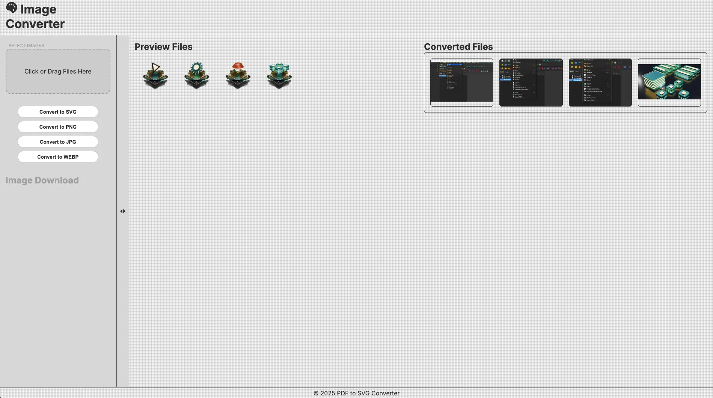
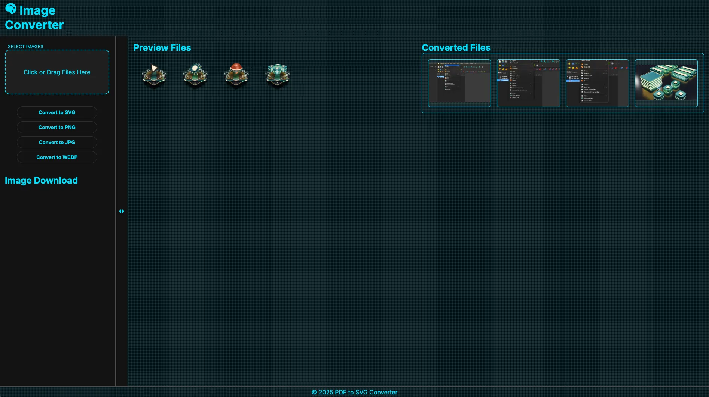
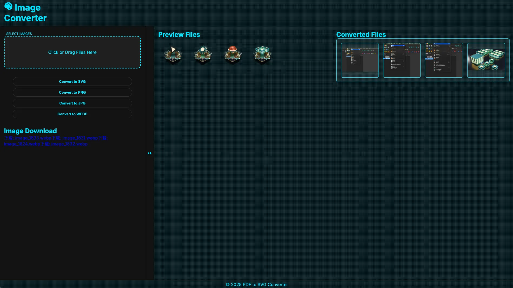
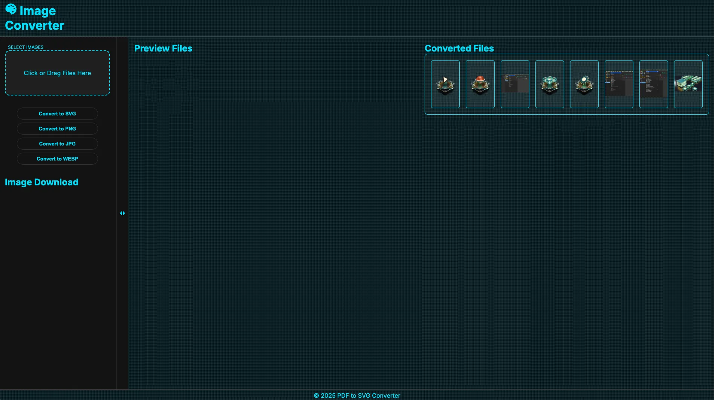

# Requirements
	•	Python 3.7+
	•	PyMuPDF (fitz)
	•	Pillow
	•	Other dependencies listed in requirements.txt

# Screenshots

(Optional: Insert some screenshots here showing the application in use.)

# Contributing

Contributions are welcome! Feel free to open an issue or submit a pull request.

# License

This project is licensed under the MIT License. See the LICENSE file for details.

Support and Sponsorship

If you find this project helpful, you can support its development!
💖 Sponsor via PayPal: aboutworks@outlook.com

Your support is greatly appreciated!

# Contact

For any questions, suggestions, or feedback, please reach out:

📧 Email: aboutworks@outlook.com
